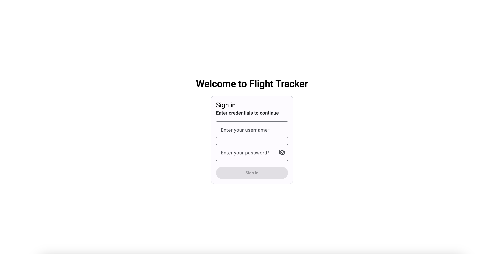
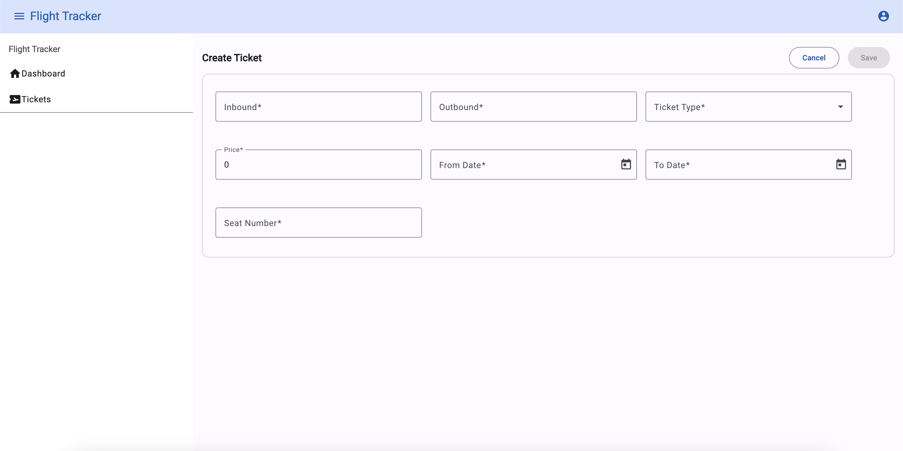

# Flight Tracker

## Overview

Flight Tracker is an Angular application for managing and tracking flight tickets. The application supports two roles: Admin and User. Users can view and filter tickets, while Admins have additional privileges, including the ability to create multiple tickets simultaneously without redirection.

## Features

- **Login Page**: Users can log in with roles Admin and User.
- **User Role**:
  - View all tickets.
  - Filter tickets.
  - View dashboard
- **Admin Role**:
  - Same privileges as User.
  - Create multiple tickets in the same form without redirection.
- **Ticket Fields**:
  - `id`
  - `inbound`
  - `outbound`
  - `ticket_type`
  - `ticket_type_id` (combination of the id and ticket_type)
  - `price`
  - `from_date`
  - `to_date` or `date_range`
  - `seat_number`
- **Validation**:
  - No duplicate tickets for the same inbound, outbound, from, to, and seat_number values.
  - Price should be a positive number.
  - From date should be before the to date.
- **Dashboard**:
  - **Average Price By Ticket Type**: Average price of tickets by ticket type.
  - **Ticket Sales Over Time**: Number of tickets sold over time.
  - **Deals**: Special deals for users.
- **Chart**: Visualization based on ticket data.

## Others

- **Window Communication**: Actions on one window reflect on another window on auth part.

## Prerequisites

- Node.js (v20 or above)
- npm (v10 or above)
- Angular CLI (v18.1.1)
- json-server (v0.17.0)

## Setup

1. **Clone the repository**:

```bash
git clone https://github.com/your-repo/flight-tracker.git
cd flight-tracker
```

2. **Install dependencies**:

```bash
npm install
cd json-server && npm install
```

## Running the Application

### Angular Development Server

1. **Start Angular development server**:

```bash
npm start
```

2. Open your browser and navigate to `http://localhost:4200`.

### JSON Server

```bash
cd json-server && npm run dev
```

2. **Run migrations optionally:**

```bash
cd json-server && npm run migrate
```

The JSON Server will be running on `http://localhost:3000`.

## UML Diagram


## Documentation

Generate documentation using Compodoc:

1. **Generate documentation**:

```bash
npm run compodoc
```

2. **Serve the documentation**:

```bash
npx compodoc -s
```

3. Open your browser and navigate to `http://localhost:8080` to view the documentation.

## Functionalities

- **Login Page**: Authenticate as Admin or User.

- **View and Filter Tickets**: Users and Admins can view and filter tickets.

- **Create Tickets**: Admins can create multiple tickets without redirection.

- **Validation**: Ensure no duplicate tickets are created.
- **Charts**: Visualize data such as revenue by ticket type, ticket sales over time, and average ticket price by ticket type.

